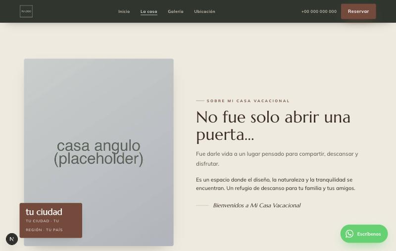
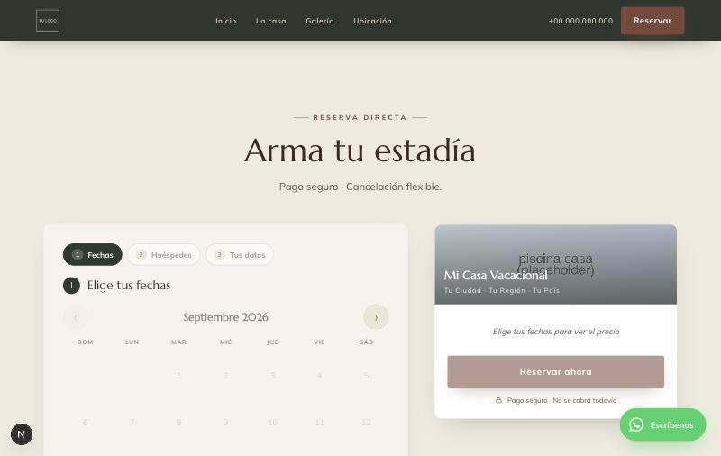
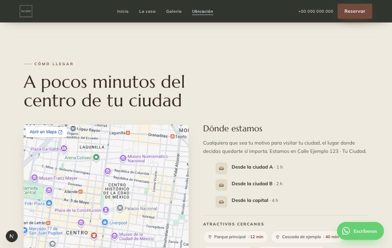

# Self-hosted direct bookings for vacation homes — an alternative to Airbnb

Run your own booking website for a vacation home, cabin or small property and **stop paying a marketplace commission on every stay**. You host the site and the database yourself: guests pick dates, see a live price, book, pay into **your own** bank account or payment-processor account, and you approve and manage everything from an admin panel.

> **Extracted from a real production system for a vacation house.**

## What this does and doesn't save you

- **What you avoid:** the booking commission that marketplaces such as Airbnb or Booking.com charge. There is no platform in the middle of the payment.
- **What you still pay:** hosting (for example Vercel and Supabase; both have free tiers to start), and whatever your payment processor or bank charges. If you use email or WhatsApp providers (Resend, SMTP, Meta's WhatsApp Cloud API), their own terms apply.
- **It can live next to Airbnb/Booking.** Your calendar can import their iCal feeds and export yours (see below), so a date booked on one side is blocked on the other. It doesn't stop you from keeping your listings there.

> All bundled content (name, copy, photos, prices, seasons, snacks, reviews) is **fictional sample data**. It is meant to be replaced with your own — see [Customization](#customization). The guest-facing site is written in Spanish; translate it in `src/lib/site-data.ts`, `src/lib/messaging/templates.ts` and the components if you need another language.

## Features

Everything below is implemented in this repository:

- **Double bookings prevented in the database.** A Postgres exclusion constraint (`no_double_booking`) rejects overlapping `pending`/`confirmed` bookings for the same property, so even two simultaneous requests cannot both succeed (the API answers 409).
- **iCal in both directions.** Import your Airbnb/Booking `.ics` feeds (a cron job turns them into date blocks) and export your confirmed bookings as an `.ics` feed those platforms can read.
- **Live availability and quotes.** Calendar of free dates and a price quote computed on the server: seasonal prices, weekday/weekend rates, extra guests, pets, optional add-ons, cleaning fee. The browser never decides the total.
- **Payments into your own accounts.** Bank transfer with an uploaded proof of payment (no third-party account needed), card payments through Payphone with your own Payphone app, and a sample bank-gateway integration. Adding another provider means implementing one interface (see [Payments](#payments)).
- **Proof-of-payment approval.** The guest uploads a proof; you confirm or reject it from the admin panel, or from buttons in the notification email (signed links that expire after 72 h and only act when pressed).
- **Notifications.** Emails through Resend or SMTP, and WhatsApp through Meta's Cloud API, to the guest (confirmation, before arrival, after the first night, before checkout, review request — editable from the panel) and to you (new booking, proof received, payment, cancellation).
- **Admin panel.** Bookings and calendar, manual blocks, prices and seasons, message templates and timeline, cash report, reviews, snack tabs, refundable deposit and outstanding balance. It has a mobile layout and lives on a secret path.
- **Snacks with a signed link.** Each booking gets a personal link (`/snacks?t=…`) to order snacks onto that stay's tab, which you settle at the end; the link only works while the booking is active.
- **Security by default.** Row Level Security on every table with an admin role that users cannot grant themselves, cron and test endpoints that fail closed, HTML escaping of guest data, and PDF receipts stored in private buckets.

## Not included

- No marketplace: nobody discovers your property through this software. Guests need your link (your own site, social media, or your listings elsewhere).
- No multi-property interface: the site and panel are configured for a single property (`SITE.slug` in `src/config/site.config.ts`).
- No tax invoicing: the PDF is a receipt, not a tax document (the generator is decoupled so you can plug in an e-invoicing provider).
- The card-payment integrations (Payphone and the sample bank gateway) are from Ecuador; use them as reference implementations for the provider you actually use.

## Screenshots

The site with the sample content (grey boxes are image placeholders):

| Home | The house |
|---|---|
|  |  |
| **Booking** | **Location** |
|  |  |

## Stack

Next.js (App Router) · React · TypeScript · Supabase (Postgres + Auth + Storage) · Resend / SMTP · WhatsApp Cloud API · Payphone · Vitest · Vercel.

## Architecture

```
Browser ──► Next.js (pages + Route Handlers /api/*)
               │        ├─ /api/reservations, /quote, /availability   (public, validated with zod)
               │        ├─ /api/admin/*        (Supabase JWT + ADMIN_EMAILS)
               │        ├─ /api/cron/*         (Bearer CRON_SECRET, fails closed)
               │        └─ /api/payments|payphone/*  (signed webhooks / server-to-server confirmation)
               ▼
          Supabase ── Postgres (RLS) · Auth · Storage (proofs and receipts, private buckets)
               ▲
    Resend/SMTP · WhatsApp Cloud API · Payphone · iCal feeds (OTAs)
```

```
src/
  config/site.config.ts   ← your identity: name, contact, location, time zone
  lib/site-data.ts        ← editable content: photo tour, amenities, copy, directions
  lib/messaging/          ← message templates and scheduling
  lib/payments/           ← gateways (PaymentProvider interface)
  app/, components/       ← public site and panel
supabase/migrations/      ← schema (0001…0018); supabase/seed.sql ← sample data
scripts/                  ← create-owner, test-emails
```

## Requirements

- Node.js 20+ and npm.
- A free [Supabase](https://supabase.com) account and, for production, a [Vercel](https://vercel.com) one.
- Optional, depending on what you enable: [Resend](https://resend.com) or SMTP, Meta's WhatsApp Cloud API, Payphone.

## Step-by-step setup

**1. Clone and install**

```bash
git clone <YOUR-REPO-URL>.git my-house
cd my-house
npm install
```

**2. Create your Supabase project** and note, under *Project Settings → API*: the **Project URL**, the **anon** key and the **service_role** key.

**3. Configure your environment variables**

```bash
cp .env.example .env.local
```

Open `.env.local` and **put in your own keys**: every variable is commented (what it is, where to get it and whether it is required). The ones required to start are the Supabase ones, `NEXT_PUBLIC_BASE_URL`, `INTERNAL_WEBHOOK_SECRET`, `CRON_SECRET` and `EMAIL_FROM`. If one is missing, the app stops with a message telling you which. **Never commit `.env.local`** (it is already git-ignored).

**4. Create the database**

With the [Supabase CLI](https://supabase.com/docs/guides/cli) (recommended):

```bash
supabase login
supabase link --project-ref YOUR-PROJECT-REF     # your project's "ref"
supabase db push                                 # applies supabase/migrations/*
```

or paste each file in `supabase/migrations/` (in order) into the Supabase *SQL Editor*. Then load the sample data by pasting `supabase/seed.sql` into the SQL Editor or running `psql "$DATABASE_URL" -f supabase/seed.sql`.

**5. Create the admin user**

Under *Authentication → Providers → Email*, **turn off "Allow new users to sign up"**, then:

```bash
npx tsx scripts/create-owner.mts you@example.com
```

It creates (or resets) the user, marks it as admin (`app_metadata.role = 'admin'`, which the RLS policies require) and prints the password **once**. Add that email to `ADMIN_EMAILS` and set `ADMIN_BASE_PATH` (the panel's secret path, e.g. `/manage-x7k2p9`).

**6. Run it**

```bash
npm run dev          # http://localhost:3000   ·   panel at http://localhost:3000<ADMIN_BASE_PATH>
npm test             # tests (Vitest)
npm run build        # production build
```

## Customization

| What to change | Where |
|---|---|
| Name, contact, location, time zone, phone prefix, booking-code prefix | `src/config/site.config.ts` |
| House copy, photo tour, amenities, directions, nearby places, fallback snacks | `src/lib/site-data.ts` |
| House rules and policies | `src/components/Policies.tsx` |
| Guest messages (email and WhatsApp) | `src/lib/messaging/templates.ts` (and from the panel) |
| Prices, seasons, minimum nights, guests, deposit | `properties` / `seasons` tables — `supabase/seed.sql` or the panel |
| Photos and logos | `public/assets/` (the current files are placeholders with the same name and format) |
| Colors and fonts | `src/app/globals.css`, `src/app/panel/panel.css`, `src/app/layout.tsx` |
| Bank details for transfers | `.env` (`BANK_*`) or panel → Settings |

The property **slug** (`SITE.slug`) must match the `slug` in `supabase/seed.sql`.

## Deploying to Vercel — recommended order

Follow this order; each step protects the next one:

1. **Admin.** Create the admin user (step 5) — migration `0018` requires `app_metadata.role = 'admin'`.
2. **Sign-up closed.** Turn off *Allow new users to sign up*. Verify: `curl "$SUPABASE_URL/auth/v1/settings" -H "apikey: $SUPABASE_ANON_KEY"` must return `"disable_signup": true`.
3. **Migrations** on your production project (`supabase db push`).
4. **Preview.** Deploy a branch as a Vercel *Preview* (with every variable set) and test: panel login, list a booking, upload a test proof of payment (the email arrives with buttons that **do not** act when opened, only when pressed), and `GET /api/cron/send-messages` without a header → 401, with `Bearer <CRON_SECRET>` → 200.
5. **Production.** Merge to `main` only when the preview is green.

Environment variables go in *Vercel → Settings → Environment Variables*. `CRON_SECRET` is required: without it the cron endpoints answer 401. `vercel.json` declares 3 daily crons (Hobby plan); for a higher frequency use a service such as cron-job.org calling the same endpoints with `Authorization: Bearer <CRON_SECRET>` (see [Cron](#cron)).

## Security

- **RLS** on every table; "admin" = `app_metadata.role = 'admin'` (`public.is_admin()`), which a user cannot assign to themselves. The `/api/admin/*` routes use the service role and validate the JWT + `ADMIN_EMAILS` (with no `ADMIN_EMAILS`, nobody is admin).
- **Signed links**: confirm/reject payments from the email (they expire after 72 h and only act on POST), snacks and reviews (HMAC).
- **Cron and test routes** fail closed; `fast-forward` only exists with `ENABLE_TEST_ROUTES=true`.
- Every piece of guest data is escaped before it goes into an email or a page.
- The panel is only served at the secret path `ADMIN_BASE_PATH`; without it, it is disabled.
- Before publishing your fork: run `gitleaks detect` and make sure you don't commit `.env*`, photos or customer data.

If you find a vulnerability, open a private GitHub *security advisory* instead of a public issue.

## License

[MIT](LICENSE)

---

# Technical reference

## No double bookings

The source of truth is a Postgres **exclusion constraint** (`btree_gist`):
two `pending`/`confirmed` bookings cannot overlap `daterange(check_in, check_out, '[)')`
for the same property. The `[)` range lets one booking's check-out equal the next
one's check-in. On a race, the loser gets `23P01` and the API answers **409**.
Airbnb/Booking blocks (`ical_blocks`) are checked in the app before inserting.

## Endpoints

### Public

| Method | Route | Description |
|---|---|---|
| GET | `/api/properties/mi-casa` | Property + active add-ons + approved reviews |
| GET | `/api/availability?from=&to=&property=` | Occupied ranges and nights (bookings + iCal) + base price per date (`nightly_prices`) |
| GET | `/api/quote?check_in=&check_out=&adults=&children=&addons=` | Live quote (nights by season + extra guests + snack box), same math as `POST /api/reservations` |
| POST | `/api/reservations` | Creates a `pending` booking; price recomputed on the server (seasonal base + extra guests); 409 on conflict |
| POST | `/api/reservations/[id]/payment-proof` | Registers a proof of payment uploaded to Storage |
| POST | `/api/reservations/[id]/pay-intent` | Starts the card payment: records the attempt in `payments` and returns the Payphone box parameters |
| GET | `/api/payphone/respuesta?id=&clientTransactionId=` | Payphone's return URL: confirms server-side with Payphone and redirects to `/?pago=…` |
| GET | `/api/ical/mi-casa.ics` | iCal feed of confirmed bookings (for Airbnb/Booking) |
| POST | `/api/payments/webhook?provider=` | Idempotent webhook + verified signature |

`POST /api/reservations` body:

```json
{
  "property_slug": "mi-casa",
  "first_name": "Ana María",
  "last_name": "Pérez López",
  "document_type": "cedula",
  "document": "0102030405",
  "email": "ana@mail.com",
  "phone": "+52 55 0000 0000",
  "country": "México",
  "arrival_time": "18h00 a 20h00",
  "pet_count": 0,
  "message": "We are celebrating a birthday",
  "companions": ["Luis Pérez"],
  "check_in": "2026-07-10",
  "check_out": "2026-07-13",
  "adults": 2,
  "children": 1
}
```

The body is validated with **zod** (`src/lib/booking-schema.ts`, shared with the
frontend). `document_type`: `cedula` (10 digits) | `pasaporte` (passport) — this
is one of the places to adapt if your country uses another ID format;
`arrival_time`: the select's time slot; `companions` ≤ guests − 1. The PDF
receipt and the host notifications use this data.

Response: the booking with the price breakdown **computed on the server** plus the
active provider's `payment` object (bank details + reference + proof upload path
for `bank_transfer`).

### Admin (header `Authorization: Bearer <Supabase Auth access_token>`)

| Method | Route | Description |
|---|---|---|
| GET | `/api/admin/reservations?status=&from=` | List with add-ons |
| GET | `/api/admin/reservations/[id]` | Detail + signed URL of the proof of payment |
| PATCH | `/api/admin/reservations/[id]` | `{ "action": "confirm" \| "cancel" \| "complete" }` |
| GET/POST/DELETE | `/api/admin/blocks` | Manual date blocks |
| GET/POST | `/api/admin/addons` · PATCH/DELETE `/[id]` | Add-on CRUD |
| GET/POST | `/api/admin/seasons` · PATCH/DELETE `/[id]` | Seasons with `weekday_price_cents` + `weekend_price_cents`; `date_end` is exclusive; the highest `priority` wins |
| GET/PATCH | `/api/admin/property` | The property's default prices (weekday/weekend) when no season applies |
| GET | `/api/admin/reviews?approved=false` · PATCH/DELETE `/[id]` | Review moderation |
| GET/POST | `/api/admin/ical-feeds` | URLs of the Airbnb/Booking .ics feeds |

`confirm` marks the booking `paid`/`confirmed` and sends the emails (Resend/SMTP)
to the guest and the host — the same path the payment webhook uses.

Admin frontend login: `supabase.auth.signInWithPassword()` with the Supabase JS
client, then send `session.access_token` as the Bearer token.

### Cron

> **Vercel Hobby only allows daily crons**: those in `vercel.json` run once a day as
> a fallback (overnight). The real frequency comes from **cron-job.org** calling the
> 3 endpoints with the header `Authorization: Bearer <CRON_SECRET>`:
> `ical-import` every 2 h, `expire-pending` every hour, `send-messages` every 15 min.

`GET /api/cron/ical-import` (auth `Bearer CRON_SECRET`): downloads the feeds registered
in `ical_feeds`, upserts into `ical_blocks` by `(property, source, uid)` and removes
blocks the OTA has released.

`GET /api/cron/expire-pending` (auth `Bearer CRON_SECRET`): cancels `pending` bookings
with `payment_status='unpaid'` older than `RESERVATION_EXPIRY_HOURS` hours (default 24)
and frees those dates.

`GET /api/cron/send-messages` (auth `Bearer CRON_SECRET`): sends the timeline messages
whose `send_at` is due (branded email + WhatsApp Cloud API); at most 3 retries per
message, then `status='failed'` with `last_error`.

## WhatsApp Cloud API — status and to-dos

> ⚠️ **Before production**: if you use Meta's test number, `WHATSAPP_TOKEN` is
> **temporary (24 h)**. For production, create a System User in Meta Business,
> generate a permanent token and move from the test number to a real one. Full
> details and the text of the 9 templates to get approved:
> [`docs/whatsapp-templates.md`](docs/whatsapp-templates.md).

The timeline sends WhatsApp through **approved templates** (mapping in
`src/lib/messaging/templates.ts` → `WA_TEMPLATES`). If a template isn't approved or
the token expired, the message stays `failed_wa` with the error logged and is
retried on the next cron run — the email ALWAYS goes out.

## Guest messaging

When a booking is **confirmed** (payment approved or transfer validated),
`confirmReservation` schedules the Airbnb-style timeline in `scheduled_messages`
(email always; WhatsApp if there is a phone number):

| template_key | when (property time) |
|---|---|
| `confirmacion` | immediately, with the **PDF receipt** attached |
| `antes_llegada` | 1 day before check-in · 15:00 (time, Maps, wifi, personal snack link) |
| `despues_primera_noche` | 1 day after check-in · 10:30 |
| `antes_salida` | 1 day before check-out · 18:00 (time and instructions) |
| `despues_salida` | check-out day · 16:00 (thanks + `REVIEW_LINK`) |

The **texts** live in `src/lib/messaging/templates.ts` (editable, Spanish) with
placeholders such as `{nombre}`, `{fecha_checkin}`, `{wifi_nombre}`, `{link_snacks}`.
If a booking is cancelled (by the host or by expiry), its pending messages are
cancelled. Late confirmations: messages whose moment has already passed are not
sent (for example, nobody is asked about the "first night" of a finished stay).

> WhatsApp: the Cloud API only delivers free-form text inside the 24-hour window
> after the user's last message; outside it Meta requires **approved templates**.
> If the guest hasn't written first, create the templates in WhatsApp Manager and
> map their names in the sender — email has no such limit and always goes out.

**PDF receipt** (`src/lib/pdf/receipt.ts`): generated server-side on confirmation
(pdf-lib), with the per-season breakdown, deposit paid and balance; stored in the
private `receipts` bucket (`reservations.receipt_path`) and attached to the
confirmation email. It is a **receipt, not a tax invoice** — the generator is
decoupled (`ReceiptGenerator`) so you can plug in an e-invoicing provider.

Wifi for the arrival message: `properties.wifi_name/wifi_password` (or the
`WIFI_NAME`/`WIFI_PASSWORD` env variables as a fallback).

## Payments

`src/lib/payments/types.ts` defines `PaymentProvider` (`createPayment` +
`verifyAndParseWebhook`). Two methods are ready to use:

- **Bank transfer** (`BankTransferProvider`): instructions + proof upload to
  Storage + manual confirmation by the admin. No third-party account needed.
- **Card — Payphone embedded box** (`PayPhoneProvider`): the guest pays inside the
  site and the booking confirms itself after server-side verification. Payphone is
  an Ecuadorian provider; use it as a reference implementation for your own.

A sample bank gateway (`PichinchaProvider`) is also available through the same
adapter with `PAYMENT_PROVIDER=pichincha` (it has a local simulator with
`PICHINCHA_STUB_MODE=true`).

### Payphone (card — embedded box)

Flow:

1. `POST /api/reservations/[id]/pay-intent` → `preparePayphoneBox()` records the
   attempt in `payments` (status `initiated`) and returns
   `{ kind: "embedded_box", box }`: amount in **cents**, `clientTransactionId`
   (≤15 chars, unique per attempt), `reference` and `storeId`.
2. The frontend renders the box (`PPaymentButtonBox`, v2.0) with
   `NEXT_PUBLIC_PAYPHONE_TOKEN`.
3. After payment, Payphone redirects to the **response URL** configured in Payphone
   Developer: `GET /api/payphone/respuesta?id=&clientTransactionId=`.
4. The server **confirms** the transaction against Payphone's API with
   `PAYPHONE_TOKEN` — mandatory **within 5 minutes** or Payphone reverses the
   payment automatically. If approved (statusCode 3) it triggers
   `processPaymentEvent` (idempotent via `payment_events`) → confirms the booking,
   sends the emails and redirects to `/?pago=exito|fallido|pendiente&reserva=<id>#reservar`.

Audit trail: every attempt is recorded in the `payments` table
(`supabase/migrations/0007_payments.sql`): provider, method (`box`|`link`),
`amount_cents`, status (`initiated|approved|rejected|error`),
`client_transaction_id` (unique per provider), Payphone's `transaction_id`,
`raw_response` and `confirmed_at`. RLS: read-only for the admin.

`generatePaymentLink(amountCents, reference, reservationId)` generates a Payphone
**payment link** (one-time, expires in 48 h) for charging over WhatsApp — a
server-side utility, no UI yet.

Environment variables: `PAYPHONE_TOKEN` (server ONLY: Confirm and Links),
`PAYPHONE_STORE_ID`, `NEXT_PUBLIC_PAYPHONE_TOKEN` (the box's browser token; Payphone
issues one token per application, exposed by design) and optionally
`PAYPHONE_CONFIRM_URL` (override of the confirmation endpoint).

### Payphone sandbox

There is no separate sandbox URL: the test environment is the credentials of an app
in **test mode**. Checklist:

1. Create a **WEB** application at
   [appdeveloper.payphonetodoesposible.com](https://appdeveloper.payphonetodoesposible.com)
   in test mode.
2. Set the **Web domain** and the **Response URL**:
   `https://<domain>/api/payphone/respuesta` (in tests
   `http://localhost:3000/api/payphone/respuesta` works).
3. Copy the app's token and storeId into `.env.local`
   (`PAYPHONE_TOKEN`, `NEXT_PUBLIC_PAYPHONE_TOKEN`, `PAYPHONE_STORE_ID`).
4. Register the test phone numbers under **"Testers"** so you can simulate payments
   with the Payphone app.
5. Review the transactions under **Testers → Transactions**. In test mode
   transactions are approved without a real charge.

### Snacks — the per-booking tab

Snacks are not part of the landing page or of the booking flow: they live at
`/snacks`, a standalone page with the same branding. **You enter with a personal
link signed per booking** (`/snacks?t=<token>`) that the guest receives in the
"before arrival" message (`{link_snacks}`); without it, `/api/snacks/*` neither
reveals nor accepts anything, and the token only works while that booking is
active. The page is not linked from the home page and is `noindex`. It shows the
menu (`category='snack'` add-ons, with a static fallback); each order is added to
the booking's **tab** (`snack_orders`, status `pending`), computed on the server
from the `addons` table, and the host settles the total at the end of the stay
from the panel.

## Booking flow (transfer)

1. The frontend draws the calendar with `/api/availability`.
2. `POST /api/reservations` → `pending` booking (the dates are held) + bank details.
3. The guest transfers and uploads the proof to the `payment-proofs` bucket (folder = booking id), then `POST /api/reservations/[id]/payment-proof`.
4. The admin reviews (`GET /api/admin/reservations/[id]` returns a signed URL of the proof) and confirms → automatic emails.
5. The confirmed booking shows up in the `/api/ical/mi-casa.ics` feed and OTAs block those dates.

## Pricing

- Each night is charged at its season's price (`seasons` table: night `N` applies if
  `date_start <= N < date_end`; the highest `priority` wins; with no season the
  property's defaults are used), and within it: **`weekday_price_cents`** (Sunday to
  Thursday nights) or **`weekend_price_cents`** (**Friday and Saturday** nights).
- The base price covers the included guests (`included_guests`); extra guests are
  charged **per person per night** (`extra_guest_price_cents`) up to `max_guests`, and
  do not vary by season or day.
- Cleaning fee per stay (`cleaning_fee`), deposit (`deposit_percentage`, 100 = full
  payment to confirm) and `min_nights`. The bundled values (in `supabase/seed.sql`)
  are examples: $100 weekday / $110 weekend, 4 included guests, $20 per extra guest,
  max 8, $20 cleaning fee.
- Recalculation is ALWAYS server-side; each booking stores its night-by-night
  breakdown in `reservations.price_breakdown` as an auditable snapshot.

## Author

Josué Arcos
